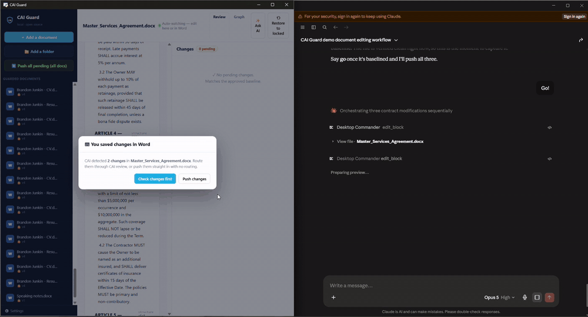

<div align="center">


# CAI Guard

**A local change-firewall for your documents.** Lock a baseline, and every future edit — yours,
a coworker's, or an AI's — is classified and held for your **approve / reject**. No cloud. No account. Your files never leave your machine.

[](LICENSE)
[](https://www.python.org/)
[](#install)
[](CONTRIBUTING.md)

<em>Track changes was built to show edits. CAI Guard was built to <strong>govern</strong> them.</em>

<!-- Add a screen recording here before launch — this single asset drives the most stars. -->
<!--  -->

</div>

---

## Why CAI Guard

You lock a contract, a resume, a policy, a spec. Weeks later something is subtly different — a
`MUST` softened to `may`, a `$2,000,000` cap quietly halved, a clause with a new "except…", a
comment silently dropped, or a file that Word now calls "corrupted." Whether it was you at 2 a.m.,
a collaborator, or an AI assistant, you never got to say yes.

CAI Guard sits beside your documents and gives you that yes. It takes a **byte-exact baseline**,
then classifies every later change deterministically — **cosmetic**, **structural**, **semantic**,
or **control-weakened** — and surfaces it for review. Nothing is trusted to a language model, and
nothing is sent anywhere.

## Highlights

- 🔒 **Baseline lock + byte-exact vault** — one-click restore to the last approved version, no formatting loss.
- 🧠 **Deterministic change classifier** — cosmetic vs structural vs **semantic** vs **control-weakened** (e.g. `MUST → may`), with the exact tokens that changed. No AI, fully reproducible.
- 🛡️ **Corruption guard** — treats a `.docx` as a package of parts + relationships, builds a Merkle rollup, and catches dropped parts, broken image/link relationships, unreadable XML, and gutted files — then offers **revert / inspect / push**.
- 🗺️ **Dependency graph** — see every internal part and relationship of a document, color-coded by status.
- 📁 **Bulk everything** — lock an entire folder in one pass; **push all pending changes across hundreds of docs** at once.
- 🧩 **Word panel** — a shield in Word's ribbon showing live status for the open document (green = in sync, red = corruption).
- ✍️ **Custom Semantic Library + Lexicon** — define which words carry meaning (add your own regulated terms) so a "harmless" swap is still caught.
- 💬 **Optional AI assistant** — bring your own key (Anthropic / OpenAI / local Ollama). It chats and *proposes* edits bound to each section's hash; you always confirm.
- 🖥️ **100% local** — deterministic engine needs no key and no network. Your documents never leave your computer.

## How it works

CAI Guard keeps two independent fingerprints for every section of a document (this separation is the
whole idea — fidelity and meaning are never merged):

- a **content hash** (exact bytes/text), and
- a **semantic hash** (only the meaning-bearing tokens: obligations like MUST/SHALL/SHOULD/MAY, amounts, durations, %, numbers, dates, parties, negations, frequency/scope words, conditions/exceptions, and your custom lexicon).

On every save it re-reads the document, aligns sections to the baseline by **content** (so inserting
or deleting a paragraph doesn't cascade), and classifies each change:

| Level | Meaning |
|---|---|
| **cosmetic** | whitespace/formatting only |
| **structural** | large rewrite / added / removed section |
| **semantic** | a meaning-bearing token changed (amount, date, obligation, exception, lexicon term…) |
| **control-weakened** | an obligation was downgraded (`MUST → SHOULD → MAY`) — the one you most want to catch |

Separately, an **integrity** pass fingerprints the document's internal OOXML parts and relationships
into a compositional Merkle rollup, to catch corruption that text-diffing can't see.

## Install

**Requirements:** Python 3.10+ (the deterministic engine, CLI, and integrity guard are cross-platform;
the desktop tray app and Word add-in are Windows-first via `pywebview`/`pystray`).

```bash
git clone https://github.com/<your-username>/cai-guard.git
cd cai-guard
pip install -r requirements.txt
pip install -e .
```

**Windows one-liner** (installs to your user profile, adds shortcuts + optional Word panel, no admin):

```powershell
powershell -ExecutionPolicy Bypass -File packaging\install.ps1
```

## Quickstart

Launch the desktop app (system-tray shield + window):

```bash
python -m caiguard app
```

…or drive it from the command line:

```bash
caiguard enroll  "Contract.docx"        # lock a byte-exact baseline
caiguard status  "Contract.docx"        # version + pending count
caiguard verify  "Contract.docx"        # list changes since the baseline
caiguard watch   "Contract.docx"        # live-watch; prints each change on save
caiguard push-all                       # accept all pending changes across every locked doc
caiguard push-all "C:\path\to\folder"   # …or just one folder
```

## Using the app

1. **Add a document** (or **Add a folder** to lock everything inside in one pass). CAI reads it, computes hashes, and vaults a byte-exact copy.
2. **Edit in Word as normal.** On save, CAI classifies what changed.
3. **Review** in the Changes panel — Approve to fold the change into the baseline, Reject to restore the original text in place.
4. **Push all pending** across every document with one button when you want to re-baseline in bulk.
5. **Restore to locked** at any time for a byte-exact rollback.
6. **Graph tab** shows the document's part/relationship map; **Re-map** re-locks the current structure.
7. **Settings → Semantic Library / Lexicon** to tune which words are meaning-bearing and add your own regulated terms.

### Word panel (optional)

A CAI Guard shield can live in Word's Home ribbon and show live status for the open document. See
[`packaging/INSTALL.md`](packaging/INSTALL.md) for the one-time sideload. The app must be running for
the panel to load (it serves locally on `127.0.0.1:4620`).

## Where your data lives

Your documents are **never modified except through an approved edit**, and nothing is written next to
them. Baselines, byte vaults, and settings live in your user profile:

- Windows: `%LOCALAPPDATA%\CAIGuard\`
- macOS/Linux: `~/.config/CAIGuard/`

Each locked doc gets `docs/<hash>/<name>.cai.json` (the manifest) plus a `vault/` byte copy of every
signed version. Delete that folder to fully un-enroll a document.

## Architecture

Pure-Python core, no database, no server dependency:

| Module | Role |
|---|---|
| `engine.py` | Deterministic classifier: content + semantic hashing, content-based alignment, weakening detection. Vocabulary is data-driven and user-editable. |
| `integrity.py` | OOXML package walk → parts/relationships → compositional Merkle rollup → named corruption alerts + dependency graph. |
| `core.py` | Lifecycle: enroll / verify / approve / reject / restore / bulk push / integrity snapshot. |
| `store.py` | Per-document manifest + byte vault in the app-data folder; atomic writes. |
| `docx_io.py` | Reads paragraphs (body + headers/footers); writes approved edits back into the `.docx` atomically. |
| `ai.py` | Optional conversational assistant (Anthropic / OpenAI / Ollama); proposes hash-bound edits only. |
| `app.py` / `ui/` | Tray app + local UI (pywebview). |
| `addin_server.py` / `addin/` | Localhost service + Word task-pane add-in. |

Run the tests:

```bash
python tests/test_engine.py
python tests/test_roundtrip.py
```

## FAQ

**Does it change my documents?** No — only when *you* approve an edit. Everything else is read-only plus a vault copy.

**Does it send my documents anywhere?** No. The engine is fully local. The only network call is the optional AI assistant, and only if *you* add a key and use it.

**Do I need an API key?** No. Detection is 100% deterministic and offline. A key only powers the optional chat/assistant.

**Word vs. CAI Guard's own edits?** CAI reads paragraph text and writes edits in place (never a full-file regeneration), so it won't corrupt a document the way "rebuild from text" tools can.

**Is it production-ready?** It's an actively developed early release (v0.1). The core lock/classify/restore path is covered by tests and has been used across hundreds of documents. Try it on copies first, and file issues.

## Roadmap

- Spreadsheet (`.xlsx`) support (cell = atom, region = module).
- Native tracked-changes write-back in Word.
- Code-file recognizer so CAI can govern source, not just prose.
- Signed/attested baselines and multi-signer approval.

## Contributing

Issues and PRs are welcome — see [CONTRIBUTING.md](CONTRIBUTING.md). Good first issues are labeled.

## Security

CAI Guard is local-first and stores nothing in the cloud. See [SECURITY.md](SECURITY.md) for the data-flow
details and how to report a vulnerability.

## License

[MIT](LICENSE) © 2026 Brandon Junkin
